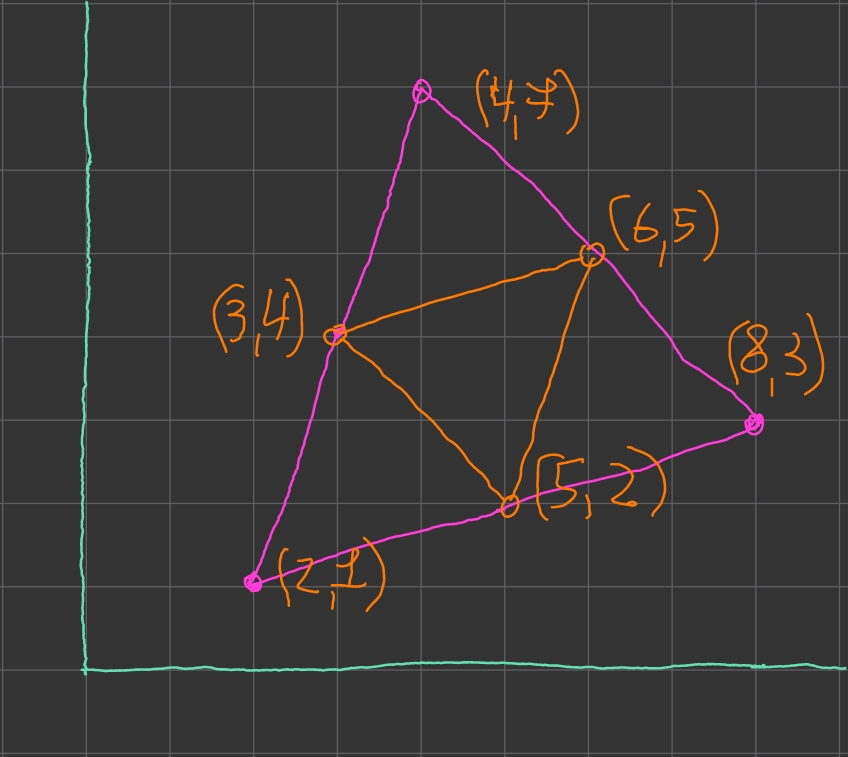
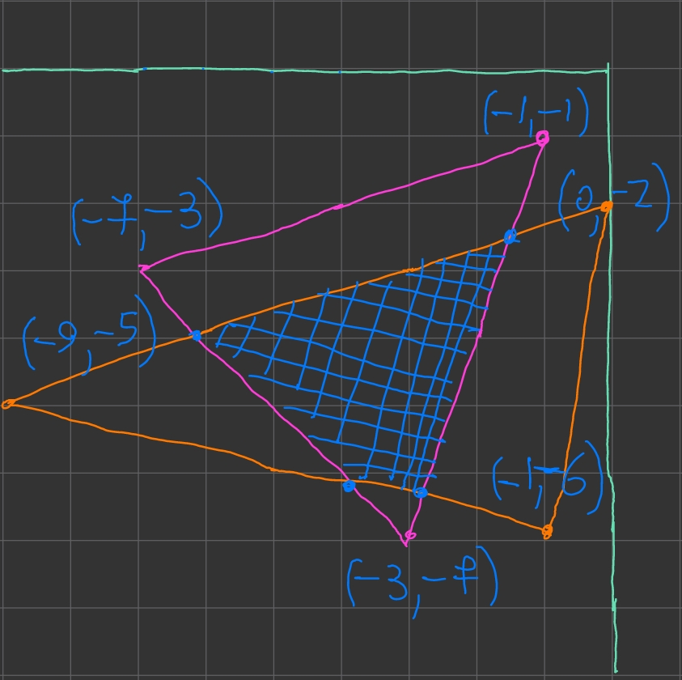

## Пересечение двух треугольников

Программа реализует пересечения двух треугольников на плоскости. 

Она выводит фигуру пересечения (набор точек её вершин) и её площадь, если она имеется.

В пересечении может получиться:
- ничего,
- точка,
- отрезок,
- треугольник,
- выпуклый четырёхугольник,
- выпуклый пятиугольник,
- выпуклый шестиугольник.

Программа состоит из нескольких файлов
- point.h
	- Реализации точки через два числа типа double
	- dist(A, B)
		- возращает евклидову метрику отрезка AB
	- is_point_between(A, B, C)
		- Принадлежит ли точка C отрезку AB
		- Реализовано на основе метода dist
	- is_section_intersected(P1, P2, Q1, Q2, & R)
		- Пересекаются ли отрезки P1P2 и Q1Q2
		- Если да, то пусть результат будет в R
		- реализован на прямых и на методе is_point_between
		
- line.h
	- Реализация прямой через общее уравнения прямой
	- where_point(P)
		- P лежит на прямой или в верхней полуплоскости или в нижней полуплоскости
		- enum LPP {lower, onto, upper}
	- line_intersection(L, R, P)
		- Пересечение прямых и результа
		- enum LIC {intersected, parallel, same}
		- если intersected, то результат записать в P
- vector.h
	- реализует вектора в виде двух чисел типа double
	- определены операции с векторами
	- collinear(v, w)
		- определяет коллинеарность векторов v и w
		- enum VC {same, opp, non}
		- возращает VC, чтобы ещё направленность коллинеарности определить
- triangle.h
	- Реализация треугольник как набора трёх точек
	- есть конструктор, который проверят, что три точки образует треугольник
	- perimeter()
	- area()
	- where_point(P)
		- проверяет внутри ли точка P треугольника
		- enum TPP {outside, inside, on}
		- возращает TPP
- polygon.h
	- ConvexQuadrilateral
		- набор 4 точек
		- конструктор строить правильный обход
		- area()
	- ConvexPentagon
		- набор 5 точек
		- конструктор строить правильный обход
		- area()
	- ConvexHexagon
		- набор 6 точек
		- конструктор строить правильный обход
		- area()
- triangle_intersect.h
	- struct seg {Point A, B}
		- с ней было легче писать код в конце, а я не хотел реализовать её вообще
	- intersect(T, Y)
		- пересекает треугольники T  и Y
		- возращает точки пересечения
		- возращает площадь пересечения

### Тесты

1.


Ввод:
```c++
Point A(0, 0), B(2, 0), C(0, 2);
Point a(0, 2), b(2, 4), c(0, 4);

Triangle T(A, B, C), Y(a, b, c);

intersect(T, Y);
```
Вывод
```
Треугольники пересекаются только в одной точке: (-0, 2)
```

2. 


Ввод:
```c++
Point A(0, 0), B(4, 0), C(4, 4);
Point a(1, 1), b(1, 4), c(3, 3);

Triangle T(A, B, C), Y(a, b, c);

intersect(T, Y);
```
Вывод
```
Треугольники пересекаются только по отрезку, концы которого равны: (3, 3); (1, 1)
```

3. 


Ввод:
```c++
Point A(1, 0), B(5, 2), C(0, 2);
Point a(4, 0), b(1, 3), c(6, 4);

Triangle T(A, B, C), Y(a, b, c);

intersect(T, Y);
```
Вывод
```
Треугольники пересекаются и в пересечении получается треугольник с точками: (2, 2); (5, 2); (3, 1)
Площадь пересечения равна: 1.5
```

4.



Ввод:
```c++
Point A(2, 1), B(8, 3), C(4, 7);
Point a(3, 4), b(5, 2), c(6, 5);

Triangle T(A, B, C), Y(a, b, c);

intersect(T, Y);
```
Вывод
```
Треугольники пересекаются и в пересечении получается треугольник с точками: (3, 4); (6, 5); (5, 2)
Площадь пересечения равна: 4
```

5.


Ввод:
```c++
Point A(0, -2), B(3, 1), C(-3, 1);
Point a(-1, -1), b(1, -1), c(0, 3);

Triangle T(A, B, C), Y(a, b, c);

intersect(T, Y);
```
Вывод
```
Треугольники пересекаются и в пересечении получается выпуклый четырёхугольник
Точки четырёхугольника равны: (-1, -1); (-0.5, 1); (0.5, 1); (1, -1)
Площадь пересечения равна: 3
```

6.


Ввод:
```c++
Point A(0, 2), B(6, 0), C(4, 6);
Point a(3, 1), b(1, 7), c(7, 5);

Triangle T(A, B, C), Y(a, b, c);

intersect(T, Y);
```
Вывод
```
Треугольники пересекаются и в пересечении получается выпуклый четырёхугольник
Точки четырёхугольника равны: (2, 4); (5, 3); (4, 6); (3, 1)
Площадь пересечения равна: 8
```

7.



Ввод:
```c++
Point A(-1, -1), B(6, 0), C(4, 6);
Point a(4, 1), b(2, 4), c(5, 3);

Triangle T(A, B, C), Y(a, b, c);

intersect(T, Y);
```
Вывод
```
Треугольники пересекаются и в пересечении получается выпуклый четырёхугольник
Точки четырёхугольника равны: (4, 1); (2.33333, 4.33333); (5.15385, 2.53846); (4, 6)
Площадь пересечения равна: 6.08974
```

8.


Ввод:
```c++
Point A(0, 2), B(6, 0), C(4, 6);
Point a(2, 0), b(2, 4), c(6, 4);

Triangle T(A, B, C), Y(a, b, c);

intersect(T, Y);
```
Вывод
```
Треугольники пересекаются и в пересечении получается выпуклый пятиугольник
Точки пятиугольника равны: (2, 4); (5, 3); (4.66667, 4); (3, 1); (2, 1.33333)
Площадь пересечения равна: 6.66667
```

9.


Ввод:
```c++
Point A(0, 0), B(6, 2), C(4, 8);
Point a(0, 4), b(4, 0), c(6, 6);

Triangle T(A, B, C), Y(a, b, c);

intersect(T, Y);
```
Вывод
```
Треугольники пересекаются и в пересечении получается выпуклый шестиугольник
Точки шестиугольника равны: (2.4, 4.8); (4.8, 5.6); (5.33333, 4); (1.33333, 2.66667); (4.5, 1.5); (3, 1)
Площадь пересечения равна: 11.8
```